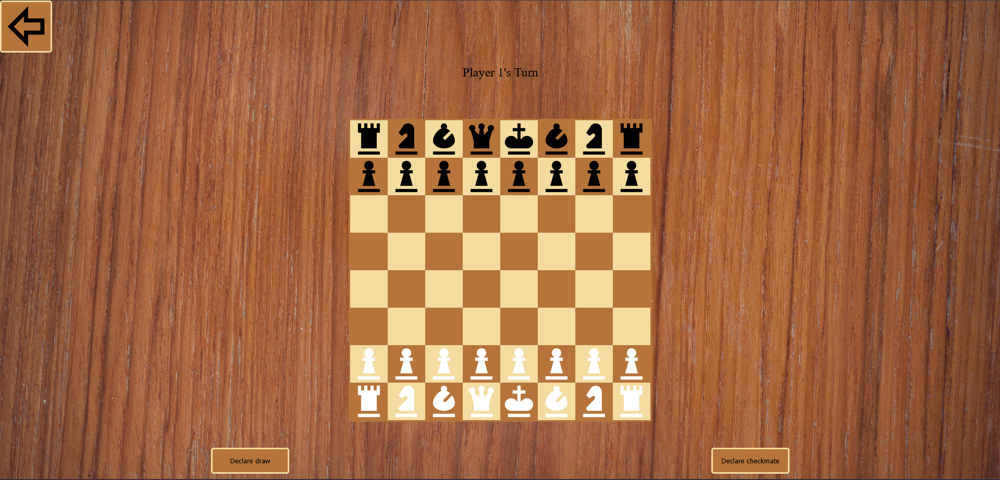

# chess

This project will implement a chess game using HTML, CSS and JavaScript. This game is played with two players locally

NOTE: 
-Manual declaration of checkmate and draw when the player's king cannot move 
-Does not include castling and pawn promotion

